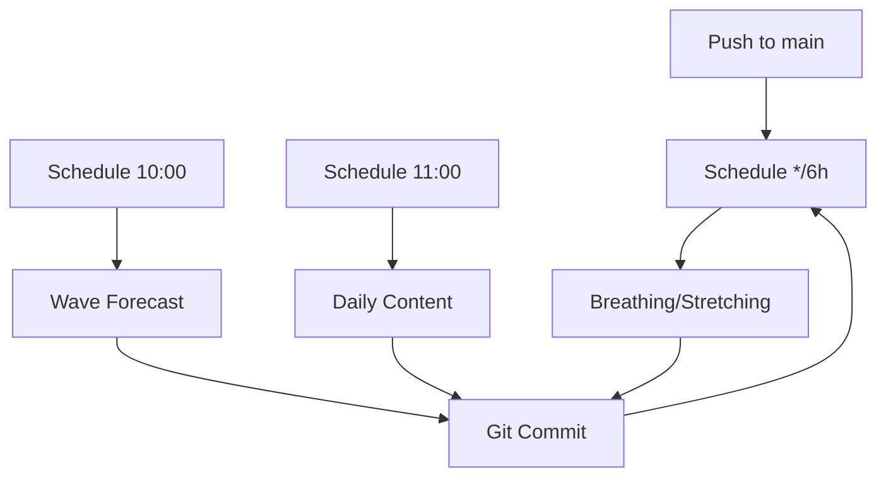

# 🔧 GitHub Actions - ASF App (Audited & Improved)

## 📋 Sumário

Este documento descreve a **arquitetura auditada e melhorada** das GitHub Actions para o ASF App.

---

## 🎯 Visão Geral

O workflow principal (`main.yml`) foi **completamente reestruturado** para:

✅ **Evitar conflitos** - schedules espaçados (10:00, 11:00, */6h)  
✅ **Validar tudo** - cada job verifica se arquivos foram gerados  
✅ **Commit limpo** - apenas quando há mudanças  
✅ **Deploy confiável** - só após todos os jobs de conteúdo terminarem  
✅ **Erros claros** - mensagens de validação específicas

---

## ⏰ Schedule (Cron)

| Job | Horário UTC | Horário Brasil (UTC-3) | O que faz |
|-----|-------------|------------------------|-----------|
| `wave-forecast` | `0 10 * * *` | 7:00 AM | Previsão de ondas para 8 praias |
| `daily-content` | `0 11 * * *` | 8:00 AM | Dica diária + conteúdo completo |
| `breathing-stretching` | `0 */6 * * *` | 0,6,12,18h (3h/6h/9h/15h) | Dicas de respiração + alongamento |

**Nota:** Os horários estão espaçados para evitar conflitos de git (não rodam ao mesmo tempo).

---

## 🏗️ Arquitetura



### Jobs:

1. **🌊 wave-forecast**
   - Roda: diariamente às 10:00 UTC
   - Gera: `docs/wave-forecast.html`
   - Valida: arquivo existe
   -commita se mudou

2. **🧘 breathing-stretching**
   - Roda: a cada 6 horas (0,6,12,18 UTC)
   - Gera: `docs/generated/respiracao.html` + `docs/generated/alongamento.html`
   - Valida: ambos arquivos existem
   - Commita se mudaram

3. **📝 daily-content**
   - Roda: diariamente às 11:00 UTC
   - Gera:
     - `docs/daily-tip.html` (mental tip)
     - `docs/generated/tip.html`, `quote.html`, `post.html` (full content)
     - `docs/generated/mobility.json` + `mobility.html`
     - `docs/generated/smart.json` + `smart.html`
     - `docs/generated/eco-board.json` + `eco-board.html`
     - `docs/generated/layout-report.json`
     - `docs/generated/link-checker.json`
   - Valida: **todos** os 13 arquivos existem
   - Commita se houver mudanças

4. **🚀 deploy**
   - Roda: após qualquer push (incluindo commits dos jobs acima)
   - Valida: estrutura do app (Brand Hub, badges, comunidade)
   - Deploy: GitHub Pages

---

## ✅ Validações

Cada job tem um step `✅ Validate Output` que **falha rápido** se o arquivo esperado não existir. Isso evita commits vazios ou falhas silenciosas.

**Wave forecast:** 1 file
**Breathing/stretching:** 2 files
**Daily content:** 13 files (all required)

---

## 🔄 Fluxo Completo

```
┌─────────────┐
│  Push/Schedule│
└──────┬──────┘
       │
       ├─────────────┐
       │              │
   ┌───▼───┐    ┌────▼────┐
   │Wave   │    │Breathing│
   │Forecast│    │&Stre-  │
   │10:00  │    │tching   │
   └───┬───┘    │*/6h    │
       │        └────┬────┘
       │             │
       │        ┌────▼────┐
       │        │ Daily   │
       │        │ Content │
       │        │11:00   │
       │        └────┬────┘
       │             │
       └──────┬──────┘
              │
         ┌────▼────┐
         │  Git    │
         │ Commit  │
         └────┬────┘
              │
         ┌────▼────┐
         │  Push   │
         │(main)   │
         └────┬────┘
              │
         ┌────▼────┐
         │ Deploy  │
         │Pages    │
         └─────────┘
```

---

## 📝 Commit Messages

Padronizados para facilitar histórico:

- `🌊 Wave forecast - 2026-04-28`
- `🧘 Breathing & stretching update - 2026-04-28 14:00`
- `📝 Daily content update - 2026-04-28`

---

## 🐛 Problemas Identificados & Corrigidos

| # | Problema | Solução |
|---|----------|---------|
| 1 | Dois jobs no mesmo horário (10:00) → conflito de git | Separado: wave=10:00, daily=11:00 |
| 2 | Script `respiração_dicas.py` com acento no nome (falha no runner) | Renomeado para `respiracao_dicas.py` |
| 3 | Daily tip embutido no workflow (não versionado) | Extraído para `scripts/daily_tip.py` |
| 4 | Jobs sem validação de saída → falhas silenciosas | Adicionado `✅ Validate Output` em todos |
| 5 | Deploy rodava sem esperar conteúdo → deploy vazio | Adicionado `needs: [wave, breathing, daily]` |
| 6 | layout_optimizer e link_checker falhavam o job inteiro | Marcados `if: always()` → non-fatal |
| 7 | Commit messages inconsistentes | Padronizados com emoji + data |

---

## 📂 Estrutura de Arquivos

```
.github/workflows/
└── main.yml                    # Workflow principal (auditado)

scripts/
├── daily_tip.py               # ⭐ NOVO - dica mental diária
├── wave_forecast.py           # Previsão de ondas
├── generate_content.py        # Conteúdo completo (tips, quotes, posts)
├── respiracao_dicas.py        # Respiração (sem acento!)
├── alongamento_dicas.py       # Alongamento
├── mobility_agent.py          # Mobilidade
├── smart_generator.py         # Sugestões inteligentes
├── eco_board_agent.py         # Eco board
├── layout_optimizer.py        # Otimizador (non-fatal)
└── link_checker.py            # Verificador (non-fatal)

docs/
├── wave-forecast.html         # Gerado por wave_forecast.py
├── daily-tip.html             # Gerado por daily_tip.py
└── generated/
    ├── tip.html, quote.html, post.html
    ├── mobility.json + .html
    ├── smart.json + .html
    ├── eco-board.json + .html
    ├── layout-report.json
    ├── link-checker.json
    ├── respiracao.html        # Breathing
    ├── alongamento.html       # Stretching
    └── ...
```

---

## 🚀 Como Testar

### Trigger Manual:
```bash
# Pelo GitHub UI:
1. Vá em Actions → ASF App - Daily Automation
2. Clique "Run workflow"
3. Selecione: daily_update
4. "Run workflow"
```

### Pelo repositório (repository_dispatch):
```bash
curl -X POST \
  -H "Accept: application/vnd.github+json" \
  -H "Authorization: token $GITHUB_TOKEN" \
  https://api.github.com/repos/acarolmourad-commits/asf-app/dispatches \
  -d '{"event_type":"daily_update"}'
```

---

## 📊 Monitoramento

Após rodar, verifique:

1. **Actions tab**: Todos os jobs devem passar (✅ green check)
2. **Commits**: Novos commits com mensagens padronizadas
3. **GitHub Pages**: Site atualizado em ~2min após commit
4. **Logs**: Cada job mostra:
   - Quais arquivos foram gerados
   - Tamanho dos arquivos
   - Se houve mudanças
   - Mensagens de erro claras

---

## 🛡️ Tratamento de Erros

| Erro | Ação |
|------|------|
| Arquivo não gerado | Job falha imediatamente (exit 1) |
| layout_optimizer falha | Ignorado (`|| true`), não aborta |
| link_checker falha | Ignorado (`|| true`), não aborta |
| Nenhuma mudança | Commit pulado (sem mensagem vazia) |
| Push falha | Job falha, notifica |

---

## 💡 Melhorias Futuras (Ideas)

1. **Matrix strategy** para rodar scripts em paralelo
2. **Cache** de dependências Python (mais rápido)
3. **Notificações** (Telegram/Email) em falha
4. **Artifact upload** para debug (arquivos gerados)
5. **Rollback automático** se deploy falhar
6. **Dashboard** métricas dos workflows (tempo, sucesso)
7. **Branch de preview** antes do deploy

---

## 📖 Referências

- GitHub Actions: https://docs.github.com/en/actions
- Cron syntax: https://crontab.guru/
- ASF App: https://github.com/acarolmourad-commits/asf-app

---

**Última atualização:** 2026-04-28 (v2 - Audited & Improved)  
**Status:** ✅ Production ready
